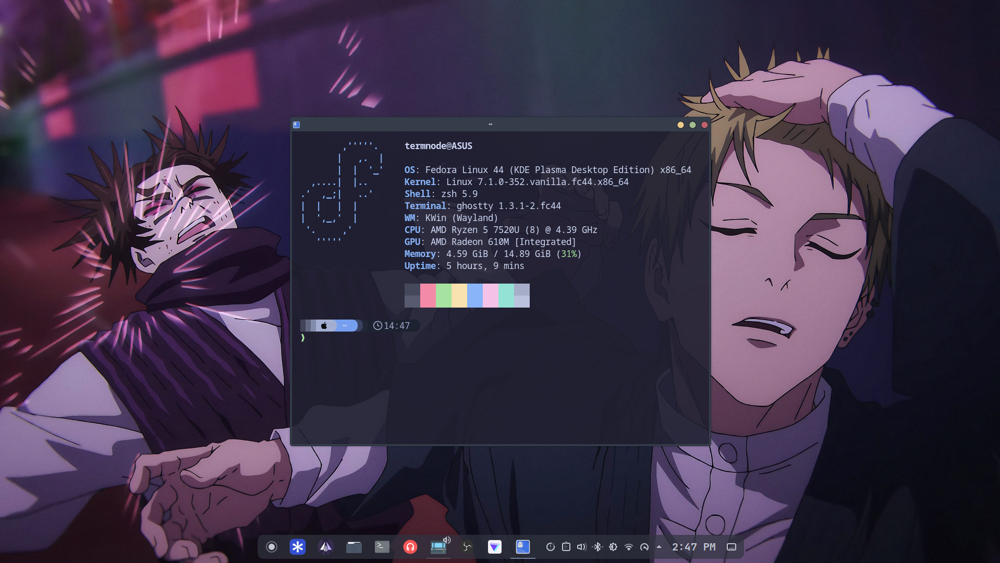
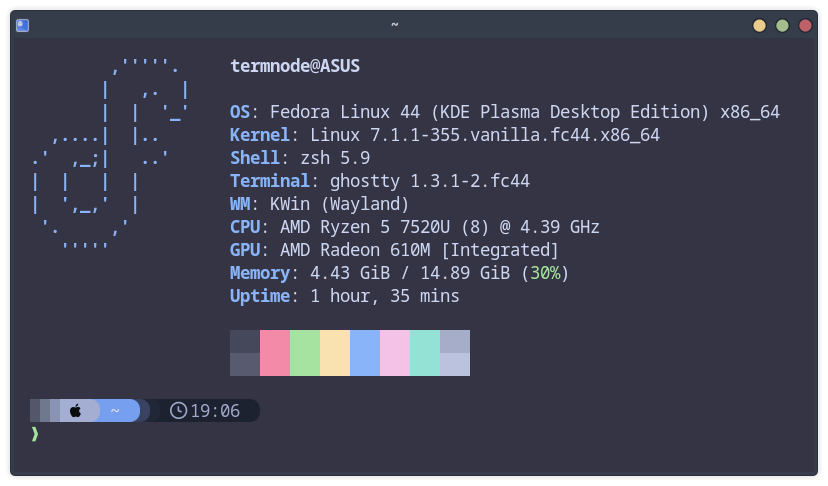

<div align="center">

# ✦ termnode · dotfiles

**My personal Linux config files — as seen on [TermNode](https://www.youtube.com/@TermNode)**





</div>

---

## Setup

| Component | Choice |
|-----------|--------|
| **OS** | Fedora 44 (KDE Plasma) |
| **Shell** | Zsh + Zinit |
| **Prompt** | Starship |
| **Terminal** | Ghostty |
| **Fetch** | Fastfetch |
| **Machine** | ASUS VivoBook Go 15 · Ryzen 5 7520U · 16GB RAM |

---

## What's Inside

---

## Install

> ⚠️ Review configs before applying. These will overwrite your existing files.

```bash
git clone https://github.com/termnode/dotfiles.git ~/dotfiles
```

Then copy manually:

```bash
# Ghostty
mkdir -p ~/.config/ghostty
cp ~/dotfiles/ghostty/config.ghostty ~/.config/ghostty/config

# Fastfetch
mkdir -p ~/.config/fastfetch
cp ~/dotfiles/fastfetch/config.jsonc ~/.config/fastfetch/config.jsonc

# Zsh
mkdir -p ~/.zshrc
cp ~/dotfiles/zsh/.zshrc
```

---

## Dependencies

```bash
# Fastfetch
sudo dnf install fastfetch -y

# Ghostty — download from https://ghostty.org

# Zsh
sudo dnf install zsh
```

---

## Related Video

> Watch the full terminal setup guide on YouTube:
> **[Terminal Customization on Linux — Zsh + Zinit + Starship + Ghostty + Fastfetch](https://youtu.be/dd4QqdoJus0?si=T25HQ0vZLAwbfs4P)**

---

<div align="center">
Made with ☕ on Fedora Linux &nbsp;·&nbsp; <a href="https://www.youtube.com/@TermNode">TermNode on YouTube</a>
</div>
